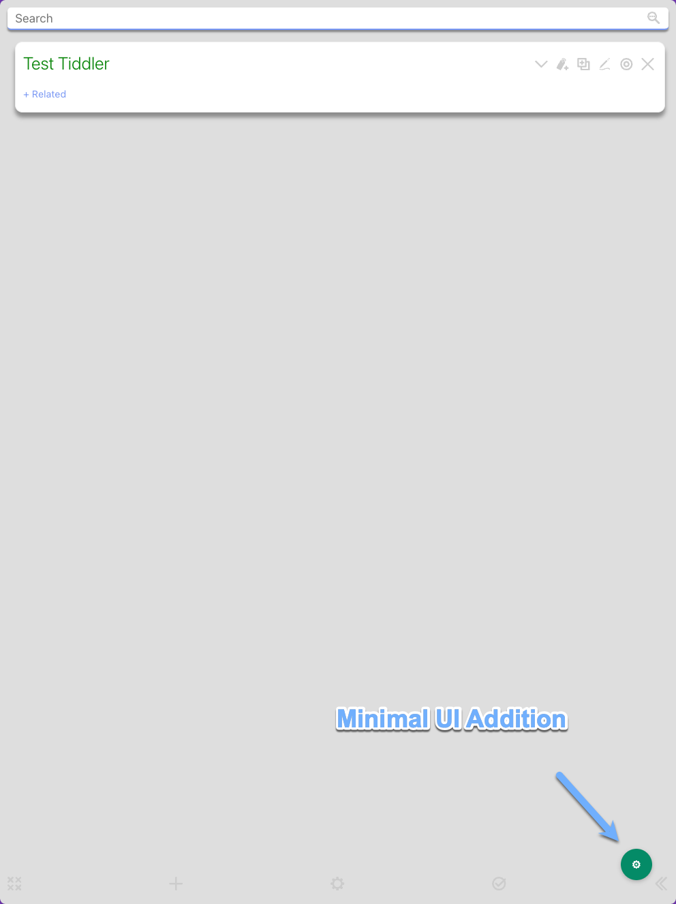

# Tiddly Drive 2

  

Tiddly Drive 2 is a modern web application that bridges the gap between [TiddlyWiki](https://tiddlywiki.com/) and cloud saving. Built with Svelte and TypeScript, it provides a smooth, reliable editing experience with intelligent conflict detection and automatic saving.

Huge thanks to the original creator [LordRatte](https://github.com/LordRatte) for the all the years of supporting this project and all the original code!!! See [the original repo here](https://github.com/tiddlydrive/tiddlydrive.github.io).

## 🚀 Quick Start

1. **Open the app** at [tiddlydrive.tonyneuhold.com](https://tiddlydrive.tonyneuhold.com)
2. **In Google Drive**, right-click any TiddlyWiki HTML file and choose "Open with → Tiddly Drive 2"
3. **Start editing!** Your changes are automatically saved back to Google Drive
4. **Customize settings** via the gear button

> The app requests the following Google Drive permissions:
>
> - `drive.file` - Core functionality to read and write files you explicitly choose to open
> - `drive.install` - Required for the "Open With" option in Google Drive's context menu
> - `userinfo.email` and `userinfo.profile` - Required for Google Workspace Marketplace publishing (data is not used by the app)

## ✨ Key Features

### 🔄 Minimal UI, Maximum Focus

  

The app adds only a small gear icon to your TiddlyWiki, keeping the interface clean and distraction-free while providing access to essential settings.

### 💾 Smart Auto-Save & Sync

- Intelligent auto-save with conflict detection
- Real-time sync with Google Drive
- Version awareness prevents overwrites
- Long-session support via secure token refresh (no server data storage)

### ⚙️ Customizable Settings

  

- Auto-save preferences and authentication
- (Hot-key support will be added in a future update)

### 🎨 Wiki Integration

  

- Uses your wiki's custom favicon and title
- Adapts to your TiddlyWiki's theme

### 🛡️ Conflict Detection

  

- Detects when files are modified in another location
- Safe save options and info on when the change occurred

### 📱 Mobile Support

  

- Responsive design for phones and tablets
- Touch-optimized controls

### 🌐 Enterprise Features

- Shared Drive support for team collaboration
- Minimal permissions with clear scope justifications:
  - `drive.file` - Access only files you explicitly open
  - `drive.install` - Enable Google Drive "Open With" integration
  - `userinfo.email` and `userinfo.profile` - Required for marketplace publishing only
- Offline fallback for network interruptions

## 🔧 Development

See the [development guide](./docs/development.md) for setup and testing instructions.
