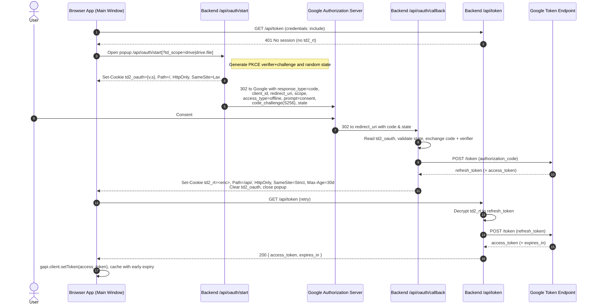

# TiddlyDrive 2 Backend (Stateless OAuth Refresh)

This backend implements a minimal, storage-free OAuth refresh flow for Google Drive.
It stores the Google refresh token in an encrypted `HttpOnly` cookie so the frontend
can fetch short-lived access tokens without prompting users every hour.

Why this design

- Stateless: No database, KV, or blob storage. A single symmetric key (env var) encrypts the refresh token.
- Secure by default: The refresh token never touches the browser; cookies are `HttpOnly; Secure; SameSite=Strict` and scoped to `/api/`.
- Standard-compliant: OAuth 2.0 Authorization Code + PKCE + `state` validation.

## Cookies

- `td2_oauth`: short-lived helper cookie with `{ v: <pkce_verifier>, s: <state> }`.
  - Attributes: `HttpOnly; SameSite=Lax; Path=/; Max-Age=600` and `Secure` only on HTTPS.
  - Rationale: Must be included on the top-level cross-site redirect back from Google to the callback.
- `td2_rt`: encrypted refresh token (`v1.iv.ciphertext.tag` in base64url).
  - Attributes: `HttpOnly; SameSite=Strict; Path=/api/; Max-Age=2592000` (~30 days) and `Secure` only on HTTPS.
  - Rationale: Only sent on first‑party requests to our API; not sent on cross-site navigation.

## Security notes

- Cookies are `SameSite=Strict` and scoped to `/api/` to reduce CSRF and exposure.
- `state` is validated; PKCE verifier is kept server-only in an `HttpOnly` cookie.
- `token.js` adds an Origin/Referer same-origin check (best-effort; not all requests include them).
- The encrypted cookie format includes a version byte for future key rotation.

---

This backend focuses on having the least code needed to remove hourly prompts, while keeping refresh tokens off the client and avoiding a storage layer entirely.

---

## End-to-end flow

### Parameter roles (why they are all set explicitly)

- `response_type=code`: Use Authorization Code flow (required for refresh tokens with PKCE).
- `client_id`: Identifies your OAuth client; not inferred from console settings.
- `redirect_uri`: Must match an authorized URI exactly; used for the callback.
- `scope`: Permissions requested (e.g., `drive.file` or `drive`).
- `access_type=offline`: Requests a `refresh_token` from Google.
- `prompt=consent`: Ensures a `refresh_token` on first consent.
- `code_challenge`/`code_challenge_method=S256`: PKCE binding between auth request and token exchange.
- `state`: Anti-CSRF token validated by the callback.

### Common PKCE/state pitfalls (local dev)

- Open the app on the same origin as your callback. If app is at `http://localhost:4320` but functions at `http://localhost:4317`, the `td2_oauth` cookie will be set on the wrong origin and won’t arrive at the callback. Use the Netlify dev origin (e.g., `http://localhost:4317`) consistently.
- Ensure `td2_oauth` uses `SameSite=Lax` and `Path=/` so it’s sent on the Google → callback redirect.
- Do not set `Secure` on HTTP localhost. Browsers ignore Secure cookies over HTTP; the cookie wouldn’t be set.
- The helper cookie expires after 10 minutes. Taking too long on the consent screen leads to a state mismatch.
- Clear old cookies if you previously used different paths (`/api/` vs `/`). Stale cookies can cause mismatches.

### Scope override during development

- Note about Mermaid syntax: semicolons in message text act as statement separators. If you must show semicolons, replace them with commas or escape them using HTML entities (e.g., `&#59;`).

- Load the app with `?td_scope=drive` to request the broader Drive scope for testing (default is `drive.file`).
- The frontend forwards `td_scope` to `/api/oauth/start`, and the backend maps it to the real Google `scope` value.
